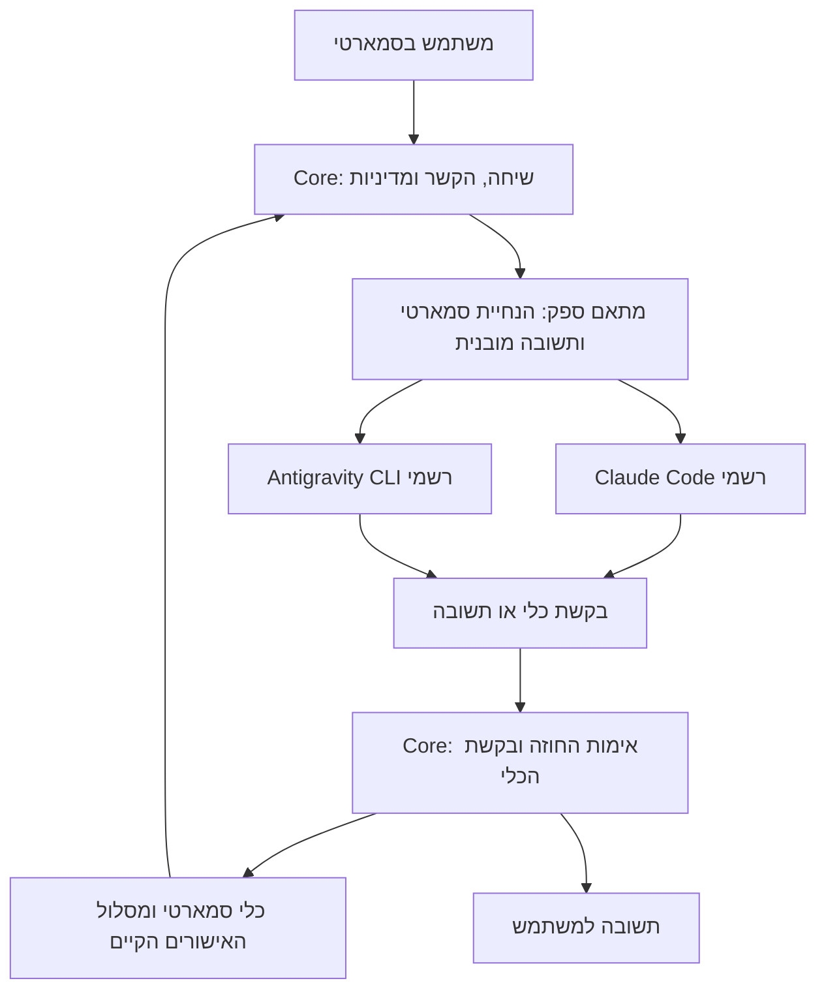

# הוספת Claude Code ו־Antigravity לסמארטי

- Plan ID: SMARTI-SUBSCRIPTION-PROVIDERS-2026
- תאריך בדיקה: 2026-10-07, Asia/Jerusalem.
- בסיס קוד שנבדק: `ee88d35`; עץ העבודה היה נקי בתחילת התכנון.
- מצב: **תכנון הושלם; מימוש ובדיקות ספק חי טרם התחילו**.
- היקף מוזמן: תכנון מלא של שני ספקים המתחברים לחשבון המשתמש דרך הכלים הרשמיים, עם כלי סמארטי, מודלים, התחברות, שגיאות וחיסכון בטוקנים.
- מקור מצב הביצוע של תוספת זו: טבלת השלבים בסעיף 15 במסמך זה. [יומן UX](ui_ux_redesign_execution.md) מתעד את זיקת הממשק לתכנון; אינו מחליף את טבלת הביצוע הזאת.

## 1. החלטת התכנון והגבולות שלה

מוסיפים שני ספקים נפרדים מספקי ה־API הקיימים:

| מזהה פנימי מוצע | שם בבורר | מסלול החשבון |
|---|---|---|
| `anthropic_claude_code_signin` | Claude Code | Claude Code רשמי, עם ההתחברות האישית של המשתמש |
| `google_antigravity_signin` | Google Antigravity | Antigravity CLI רשמי, עם חשבון Google של המשתמש |

ליבת סמארטי נשארת הבעלים של השיחה, הנחיית המערכת, לולאת הסוכן (המחזור תשובה→כלי→תוצאה→המשך), הרשאות, אישורים, זיכרון, כלים, MCP, Skills ומשימות. הספק מחזיר הוראות לכלי סמארטי או תשובה למשתמש; הוא אינו מפעיל בעצמו קבצים, מסוף, דפדפן או סוכני משנה.

כיוון זה מתאים לחיבור Codex **שקיים בפועל במאגר**. אין להסיק מהשיחה המצורפת שה־CLI צריך לנהל לולאת סוכן נוספת. בחירת SDK להובלה ולגילוי מודלים אינה מעבירה אליו את כלי סמארטי.

ל־Claude קיימת תשתית רשמית מתאימה, בכפוף לאימות התצורה המשולבת. ל־Antigravity קיימים CLI, זרם אירועים וסוכנים מותאמים; עדיין צריך להוכיח במסלול המנוי שההנחיות המובנות וכלי הספק הוסרו במידה הנדרשת. אין להציג תכנון זה כהוכחה שכבר הושגה התאמה מלאה.

הסרת הנחיית ברירת המחדל פירושה הסרת זהות עוזר הקוד, הוראות העבודה וכללי הכלים של הלקוח, והצבת הנחיית סמארטי במקום. הוראות בטיחות של השירות ומדיניות ארגונית מחייבת אינן הבטחה שניתן להסיר. מגבלה מחייבת שמונעת תצורה מתאימה מקבלת אבחון ברור; אין לנסות לעקוף אותה.

## 2. מה אומת בתיעוד הרשמי

המידע הוא תמונת מצב לתאריך לעיל. קישורים ותצורות נבדקים מחדש בתחילת המימוש, ובמיוחד לפני הפצה.

| נושא | ממצא מהמקור | המשמעות לתכנון |
|---|---|---|
| Claude: שימוש במנוי | עדכון התמיכה מ־15 ביוני משהה את המעבר לאשראי SDK נפרד: SDK, `claude -p` ושימוש אפליקציות צד שלישי עדיין צורכים את מכסת המנוי | אין לבנות על טבלת האשראי ההיסטורית שמופיעה בהמשך אותו דף. [תמיכה רשמית](https://support.claude.com/en/articles/15036540-use-the-claude-agent-sdk-with-your-claude-plan) |
| Claude: אופן ההתחברות | התיעוד מבחין בין אירוח הבינארי הרשמי עם התחברות המשתמש לבין איסוף או תיווך פרטי ההתחברות שלו | ההתחברות הושלמה בזרימת Anthropic; סמארטי אינה מחזיקה אסימוני Claude ואינה משמשת שרת משותף למנויים. יש לקרוא את ההגבלות יחד עם דף התמיכה, ולא להסיק היתר גורף לכל צורת אינטגרציה. [תנאים ואימות](https://code.claude.com/docs/en/legal-and-compliance#authentication-and-credential-use) |
| Claude: אסימון למנוי | `claude setup-token` מפיק אסימון OAuth לשנה, מודפס בלבד; `CLAUDE_CODE_OAUTH_TOKEN` משתמש במנוי ומאפשר בקשות מודל, ללא Remote Control או חיבורי claude.ai. MCP מקומי עדיין אפשרי; bare אינו קורא גם אסימון זה | מסלול מתקדם אפשרי דרך סביבת המשתמש של הבינארי הרשמי; אינו API key ואינו תחליף לבידוד כלים/הנחיות. אין לאסוף או לשמור אותו בסמארטי. [יצירת אסימון](https://code.claude.com/docs/en/authentication#generate-a-long-lived-token), [גבולות connectors](https://code.claude.com/docs/en/agent-sdk/claude-code-features#what-settingsources-does-not-control) |
| Claude: הוראות וכלים | אפשר להחליף system prompt; רשימת `tools` שולטת בכלים המובנים, ואילו `allowedTools` היא בעיקר הרשאה ללא שאלה | משתמשים בהחלפה וברשימת כלים ריקה, עם ביטול MCP עצמאי. [CLI reference](https://code.claude.com/docs/en/cli-reference#system-prompt-flags) |
| Claude: מצב bare | `--bare` אינו קורא OAuth או keychain ואינו משתמש בכניסה למנוי | **לא משתמשים ב־bare במסלול המנוי**, גם אם הוא חוסך זמן אתחול. [הרצה מתוכנה](https://code.claude.com/docs/en/headless#start-faster-with-bare-mode) |
| Claude: SDK רשמי | TypeScript SDK מתעד `supportedModels()`, `accountInfo()`, מידע על רמות חשיבה, interrupt ושליטה בתצורה | נבחר מתאם Python עם תהליך עזר קטן של ה־SDK הרשמי ב־Node לצורך קטלוג ותשובות, כדי להשתמש בממשקים המתועדים. [SDK reference](https://code.claude.com/docs/en/agent-sdk/typescript) |
| Claude: בידוד הגדרות | רשימת setting sources ריקה אינה מבטלת מדיניות managed ואת כל התצורה הגלובלית | אפס מקורות הגדרות הוא חלק מהבידוד; נדרשת בדיקה נפרדת של תוספות גלובליות ומדיניות. [גבולות settingSources](https://code.claude.com/docs/en/agent-sdk/claude-code-features#what-settingsources-does-not-control) |
| Antigravity: הובלה | CLI תומך ב־headless, JSON, NDJSON, קלט מתמשך, schema ומודל לפי slug | מתאם CLI ישיר ל־Python הוא מסלול המנוי הראשי. הצלחה נבדקת לפי result ולא רק exit code. [Headless](https://www.antigravity.google/docs/cli/headless/) |
| Antigravity: מערכת מותאמת | סוכן Markdown יכול להיות main agent, עם הגדרות כלים והוראות משלו | סוכן מקומי ייעודי לסמארטי; התיעוד אינו מספיק להוכחת הסרת כל מסגרת ההנחיות בתצורת המנוי. [Custom agents](https://www.antigravity.google/blog/introducing-custom-agents), [פורמט הסוכן](https://antigravity.google/docs/subagents?tab=cli) |
| Antigravity: SDK | קיימים CustomSystemInstructions וכלי capabilities; ההתחלה הרשמית מתועדת באמצעות API key או Google Cloud | אין להמיר את מסלול המנוי ל־SDK ולחייב API ללא החלטה. התאמת SDK להנחיות אינה הוכחה שהוא משתמש במנוי. [SDK overview](https://www.antigravity.google/docs/sdk/overview/), [Personas](https://www.antigravity.google/docs/sdk/personas/), [Tools](https://www.antigravity.google/docs/sdk/tools/) |
| Antigravity: מודלים ומכסה | זמינות משתנה לפי תוכנית; קיימות מכסות וגם אפשרות חריגה באמצעות AI credits | מציגים רק קטלוג של החשבון, עם מצב מכסה ומידע על חריגות אם הוא זמין. [Models](https://www.antigravity.google/docs/models/), [Plans](https://www.antigravity.google/docs/plans/) |
| Windows | Antigravity CLI מותקן למשתמש ומשתמש ב־Credential Manager ב־Windows; Claude מספק כניסה רשמית | לא מסתמכים על נתיב מחשב המפתח ולא מעתיקים מאגר סודות. [התקנת Antigravity](https://www.antigravity.google/docs/cli/install/), [Claude authentication](https://code.claude.com/docs/en/authentication) |

השיחה `6ac3d245-1984-83eb-9078-3909275d4f35` נקראה כהקשר. היא אינה מקור מכריע לזכאות, לתנאים, לשמות מודלים או לפרוטוקול. בפרט, כלי SDK של Antigravity אינם הוכחה לאותן יכולות ב־CLI, וסוכן מותאם אינו כשלעצמו הוכחה להחלפה מלאה של ההנחיה.

## 3. מפת הקוד הנוכחי ונקודות החיבור

| אזור | מצב בקוד שנבדק | שינוי מתוכנן |
|---|---|---|
| `smarti/codex_signin.py` | `complete()` מפעיל `codex exec` זמני; משתמש ב־model instructions וב־SMARTI_TURN_OUTPUT_SCHEMA; גילוי דרך App Server | משמש תקדים וחבילת רגרסיה. לחלץ בהדרגה חוזה תשובה ועזרים משותפים, בלי לשכתב את הובלת Codex |
| `smarti/common.py` | 18 ספקים; קטלוגים, defaults, reasoning ו־fetch_text_models_for_provider; ענף ייעודי ל־Codex | להוסיף שני מזהים ומטא־נתוני subscription; לנתב גילוי למתאם ולהרחיב יכולות לפי מודל |
| `smarti/config.py`, `smarti/managers.py` | ברירות מחדל, מיגרציות ושמירת בחירה | הגדרות מודל לכל ספק, timeouts ומסלול מעבר משמר |
| `smarti/agent/model_context.py` | setup, תקציב, prompt, reasoning, API retry, שימוש ויצירת כותרת | ענף משותף לספקי מנוי; `purpose=agent` מול title/summary; להחיל אותו טיפול בתקציב ובשגיאות |
| `smarti/agent/messaging.py` | לולאת סמארטי מתקנת כרגע CodexProtocolError באופן מיוחד | שגיאת פרוטוקול כללית וספירת תיקונים מוגבלת, עם תאימות ל־Codex |
| `smarti/agent/lifecycle.py` | provider/model מוקפאים ב־run snapshot וב־run_values | להוסיף handles למתאמים ולהפריד כל ריצה ושיחה; שינוי בהגדרות לא משנה ריצה פעילה |
| `smarti/agent/shared.py`, `background_runtime.py` | תלות Codex ופעילות קדמית/רקע | imports ממוקדים, ניקוי תהליכים וחשבון ספק נכון גם במשימה חוזרת |
| `smarti/agent/tool_calls.py`, `execution_policy.py`, `tool_dispatch.py` | פענוח, אימות, הרשאות וביצוע כלי סמארטי | ממשיכים במסלול זה בלבד; אין dispatch חדש מתוך CLI |
| `smarti/attachments.py` | אין adapter לצירופים של שני המזהים החדשים | מטריצת צירופים לפי ההובלה והמודל, עם העלאה מורשית ומשוב מתאים |
| `smarti/api_errors.py`, `api_error_catalog.py` | אבחון אחיד למשתמש; חלק מ־signin reasons כרגע Codex בלבד | reasons משותפים עם פירוט ספק ומכסה, ללא אבחון כל 429 כפג תוקף |
| `smarti/local_gateway.py` | `/v2/providers/...` לגילוי/חשיבה; פעולות `codex_*` hardcoded | פעולות connection כלליות עבור החדשים; Codex הישן נשאר תואם |
| `smarti/control_plane_contract.py`, `desktop-contract/v2.contract.json` | סכמות ופלט נוצר | עדכון המקור ויצירה עם `scripts/generate_desktop_contract.py`; לעדכן גם הצרכנים שנוצרו |
| `smarti/desktop_services.py` | קבוצות הגדרות ואבחון | לזהות שדות חדשים, מצב CLI, תלויות וגרסה |
| `desktop/src/SettingsManagement.tsx` | ProviderWorkflow, secret fields, מודלים וענף UI ייעודי ל־Codex | רכיב חיבור ספק משותף; שני הספקים אינם שדות API key |
| `desktop/src/managementCatalog.ts`, `ProviderPicker.tsx` | רשימה סטטית ו־18 SVG; רוחב לפי התווית הארוכה | להוסיף שני פריטים ויצירות המשתמש, ולשמור מדידת רוחב, RTL ומקלדת |
| `desktop/src/chatTypes.ts`, `Composer.tsx`, `UsageView.tsx`, `settingsChanges.ts` | בחירה, מועדפים, שימוש וסנכרון settings/bootstrap | יכולות מודל, שימוש במנוי ואזהרות; guards נגד תשובות ישנות |
| `smarti/ui_pages.py`, `workers.py`, `chat.py` | לקוח PyQt עדיין קיים | לוודא שהוספת מזהים אינה שוברת את הלקוח; אם נדרש UI פעיל שם, לחבר לאותו שירות ללא אינטגרציה כפולה |
| `smarti/runtime.py`, `packaging/`, סקריפטי staging | Python/Node פרטיים וחבילות Windows | לארוז תהליך עזר ותלויות נעולות; להפריד מ־CLI חיצוני/רכיב ספק רשמי |

נמצא פרט שיש לתקן במסגרת ההכללה: פעולת `codex_status` ב־gateway עשויה לשמור את Codex כספק פעיל כאשר המצב connected. בשירות החדש, **קריאת מצב ורענון קטלוג אינם משנים ספק או מודל**. בחירה היא פעולה מפורשת; תיקון ההתנהגות הקיימת ייבדק עם סנכרון settings/bootstrap.

## 4. החוזה הפנימי המשותף

להוסיף `smarti/subscription_providers/` עם `base.py`, `process.py`, `protocol.py`, `catalog.py`, `claude_code.py` ו־`antigravity.py`. אלה שמות מתוכננים, לא קבצים שכבר קיימים. תהליך העזר הרשמי של Claude יקבל תיקייה עצמאית עם package lock; אינו קוד React ואינו מנהל OAuth.

```text
detect() -> DependencyInfo
connection_status() -> ConnectionState
begin_login() -> ConnectionOperation
poll_operation(id) / cancel_operation(id)
disconnect(scope) -> ConnectionState
read_models() -> ModelCatalog
read_usage_limits() -> LimitsSnapshot | unavailable
complete(RequestContext, messages, on_event, cancel_event) -> ProviderTurn
close(owner_id)
```

`RequestContext` כולל `provider`, `requested_model`, `reasoning_effort`, `purpose`, `smarti_session_id`, `run_id`, `request_id`, revision, cancellation ותקציב. עבור Claude מוקפאים גם `auth_strategy` ו־`auth_revision` שאינם סודיים; אסימון אינו חלק מהבקשה או מה־NDJSON. ספק אינו קורא מחדש api_mode גלובלי באמצע ריצה. אבחון אינו מחייב יצירת תשובה בתשלום/במכסה.

`ProviderTurn` כולל תשובה מפוענחת, usage, מזהה ספק פנימי אם יש, המודל שהופעל בפועל, סיבת סיום ומצב סופי. בשלב הראשון הוא מתורגם לפורמט התשובה שהלולאה הקיימת כבר מקבלת. אין שכתוב רחב של ליבת הסוכן כתנאי להוספת הספקים.

אירועים פנימיים: `started`, `status`, `answer_delta`, `usage`, `retry_notice`, `completed`, `failed`, `cancelled`. שדות מזהי ריצה ומספר רציף מאפשרים סינון אירועים ישנים. זיהוי כלי מובנה של הספק הוא אירוע הפרת חוזה; אינו הופך ל־tool_start של סמארטי כאילו זו פעולה מורשית שלה.

במענה מובנה, answer_delta מגיע רק מהשדה final_answer לאחר פענוח בטוח של המעטפת; לא מציגים raw JSON, arguments או thinking blocks של הספק. אם אין דרך אמינה להזרים טקסט מתוך המעטפת, מציגים מצב המתנה ומוסרים את התשובה אחרי אימות. טקסט שנזרם לפני completion הוא תשובה חלקית וניתן לסמן שנקטע; הוא אינו הוכחת הצלחה. progress_report מאומת מוצג לפני כלי סמארטי, והפעילות עצמה מגיעה מהביצוע של סמארטי.



## 5. Claude Code — מסלול המימוש המועדף

### 5.1. הובלה וגילוי

Python מפעיל תהליך עזר קטן ב־Node הפרטי של סמארטי. תהליך זה משתמש ב־`@anthropic-ai/claude-agent-sdk` ובבינארי Claude Code הרשמי. התקשורת המקומית היא NDJSON ב־stdin/stdout עם request_id; לוגים מושחרים ב־stderr. ה־SDK הוא מנהל הפרוטוקול הרשמי, ואילו סמארטי נשארת מנהלת הכלים.

הסיבה לבחירת TypeScript SDK היא הממשק הרשמי ל־`supportedModels()` וליכולות חשיבה, נוסף על interruption וזרם הודעות. אין לקרוא endpoints פרטיים כדי להשיג קטלוג. יש להשתמש בממשקי metadata לפני generation, ולא לשלוח prompt רק כדי לברר רשימה. יש לאמת זאת ב־SP-0.

אפשר להשתמש ב־CLI ישיר לניסוי ולבדיקות התחברות. אם הבדיקה תוכיח שהתהליך העזר מיותר ו־CLI נותן באופן רשמי את אותו קטלוג ושליטה, אפשר לפשט ולתעד את ההכרעה. אין להמציא פקודת `claude models` או פרוטוקול פרטי.

### 5.2. תצורת הסקה

ההגדרות המתוכננות של ה־SDK הן systemPrompt מותאם, `tools: []`, ללא MCP, `strictMcpConfig: true`, `settingSources: []`, ללא Skills/plugins/agents שנמסרו, ו־permission mode שאינו auto/bypass. גם callback הרשאה דוחה כל כלי ספק בלתי צפוי. הרשאת allow אינה תחליף להסרה מההקשר.

משתמשים ב־custom prompt ולא ב־preset claude_code, ולא ב־append. `--bare` אינו מופעל. אם גרסת SDK משנה default למצב bare, תצורת המנוי חייבת לבטל זאת בצורה רשמית או להיחסם כגרסה לא תואמת; אין fallback סמוי ל־API.

מגבילים hooks/auto-memory/output-style ו־connectors גלובליים דרך אפשרויות רשמיות זמינות, בלי לערוך את קובצי המשתמש. למשל autoMemoryEnabled=false ו־disableClaudeAiConnectors=true אם הגרסה שנבחרה תומכת בהן. strictMcpConfig נדרש גם כאשר mcpServers ריק. יש לאמת את מה שנשאר תחת managed policy. במסלול הכניסה הרגיל directory נקי הוא תיקיית עבודה בלבד: אין להחליף את HOME או את תיקיית האימות ולאבד את הכניסה. במסלול האסימון אפשר לבחון `CLAUDE_CONFIG_DIR` נפרד לתהליך הרשמי בלבד, משום שהאימות מגיע מהסביבה; זהו ניסוי בידוד ב־SP-0, מותנה בשימור מדיניות מחייבת, ואינו דרך לעקוף אותה.

הנחיות ארוכות נמסרות דרך קובץ זמני פרטי או האפשרות הרשמית המקבילה בגרסה שנבחרה, כדי להימנע ממגבלת command line ב־Windows. שיחה וצירופים נמסרים בהודעות הקלט, ולא בשורת הפקודה. `persistSession: false` הוא בסיס ההרצה הראשונה; resume מופעל רק בשלב החיסכון שאומת.

JSON schema עשוי לדרוש כלי פנימי ליצירת structured output. SP-0 בודק את שילוב tools-empty/schema. אם נדרש כלי פנימי, מותר רק serializer/terminator רשמי ללא השפעה חיצונית, לאחר בדיקה ותיעוד שמו, הסכמה שלו ועלות ההקשר. אין לפתוח הרשאות קבצים/מסוף כדי לגרום לפלט מובנה לעבוד.

### 5.3. התחברות וחשבונות

ברירת המחדל היא `auth_strategy=claude_login`: הזרימה משתמשת ב־`claude auth login`, ללא `--console`. קריאת מצב נעשית דרך `claude auth status` וה־SDK; הפלט הרשמי הוא JSON. mode כמו api_key/api_key_helper/third_party אינו הצלחת חיבור למנוי, גם אם CLI מחובר טכנית. נדרש auth mode מתאים של claude.ai ופרטי תוכנית אם השירות מספק אותם. מסלול נוסף, `setup_token_env`, מתואר ב־§5.4; אין לזהות אותו באמצעות פרטי הכניסה השמורה של חשבון אחר.

מסננים בסביבת תהליך ההסקה בלבד credentials/endpoint overrides שעלולים להסיט ל־API, כגון ANTHROPIC_API_KEY, ANTHROPIC_AUTH_TOKEN, profile/federation credentials והפעלת cloud providers; אין שינוי משתני מערכת או הגדרות API של המשתמש. `CLAUDE_CODE_OAUTH_TOKEN` מסונן ב־claude_login, ונשאר בירושת הסביבה של התהליך הרשמי רק כשנבחר setup_token_env במפורש. אין אימוץ שקט של אסימון סביבתי. מקורות API קודמים לאסימון בסדר העדיפות הרשמי, ולכן עצם קיומו אינו הוכחת חיוב במנוי. CLI חי עדיין עשוי לקבל מדיניות מחייבת או אישור API שמור: האימות הרשמי הסופי בודק את המסלול בפועל. אין לקרוא קובצי credentials כדי לברר זאת.

`claude auth logout` מוחק כניסה משותפת של CLI; לכן פעולת ניתוק סמארטי ויציאה מהחשבון בכלי הרשמי הן שתי פעולות עם משמעות ברורה למשתמש. ברירת המחדל של ניתוק סמארטי עוצרת את handles שלה ומשאירה את כניסת ה־CLI, עם מצב „מנותק מסמארטי”. כאשר המשתמש בוחר יציאה מהחשבון הרשמי, מתארים את ההשפעה ומפעילים logout דרך CLI.

### 5.4. אסימון Claude Code — אפשרות נוספת והעדפה לפי שימוש

בתוכנית המקורית לא פורט מסלול `claude setup-token`, והסינון הגורף של אסימון סביבתי היה מונע אותו. העדכון מבחין בין אסימון רשמי שהמשתמש יצר בזרימת Anthropic לבין API key, אסימון שנשלף מקובץ credentials או session token שהועתק מהדפדפן. שני האחרונים אינם מסלול החיבור המתוכנן.

| שיקול | כניסה שמורה — claude_login | אסימון רשמי — setup_token_env |
|---|---|---|
| חיבור למשתמש רגיל | כפתור כניסה וזרימה רשמית; ללא העתקת סוד | יצירת אסימון והגדרת סביבת הפעלה בידי המשתמש; יותר צעדים |
| בידוד ההסקה | נדרשת חסימה מפורשת של תוספות החשבון והמחשב | הרשאת בקשות מודל בלבד; חיבורי claude.ai אינם נטענים. עדיין חייבים לחסום MCP מקומי וכלים/הגדרות |
| רענון | נשאר בבעלות Claude Code | אין מנגנון רענון בסמארטי; פקיעה או ביטול דורשים אסימון חדש מהמשתמש |
| קטלוג, חשבון ומכסה | נבדקים דרך הממשקים הרשמיים של אותה כניסה | יש לאמת כל ממשק עם האסימון עצמו; אין להבטיח ש־accountInfo/מכסה זמינים או לשייך פרטי כניסה אחרת |
| טוקנים וחיוב | מנוי, בכפוף לחשבון ולחריגות | אותו מסלול מנוי; אין הנחת מחיר, תוספת מכסה או חיסכון בטוקני prompt מעצם החלפת אמצעי האימות |

**הכרעה:** כניסה שמורה נשארת ברירת המחדל למוצר שמבקש חיבור פשוט. אסימון עדיף באופן נקודתי להרצה ללא ממשק ולצמצום הרשאות האימות, ולכן מתוכנן כמסלול מתקדם באותו ספק, לאחר בדיקות SP-0. אין להפוך אותו לברירת מחדל לכל המשתמשים לפני שנבדקו הקטלוג, המדיניות והתחזוקה. שני המסלולים משתמשים באותו SDK/CLI רשמי, custom prompt, tools ריקים ופרוטוקול סמארטי. `--bare` אינו אפשרי עם אף אחד מהם.

המשתמש מפעיל `claude setup-token` במסוף הרשמי ומגדיר בעצמו `CLAUDE_CODE_OAUTH_TOKEN` בסביבת ההפעלה שלו. סמארטי אינה מריצה את הפקודה כדי ללכוד את stdout שלה, אינה מציעה שדה הדבקת אסימון ואינה שומרת אותו ב־settings/keyring/גיבוי/לוג. ה־SDK/CLI הרשמי יורש את משתנה הסביבה במסלול שנבחר, בלי להעבירו ב־argv, HTTP או NDJSON; אין להוריש אותו לכלי סמארטי או לספק אחר. גם קריאת מצב אינה מדפיסה את הסביבה. בחירת האסטרטגיה נשמרת כערך לא סודי בלבד.

זהו תכנון להפעלת הבינארי הרשמי בסביבת המשתמש, ולא למימוש OAuth בסמארטי או לפנייה ישירה ל־API בעזרת אסימון המנוי. [מגבלות Anthropic](https://code.claude.com/docs/en/legal-and-compliance#authentication-and-credential-use) אוסרות על מפתחי צד שלישי לאסוף, לשמור או לתווך credentials/session tokens, ומבחינות בכך מכניסת המשתמש לבינארי שלא שונה. הפצה חייבת להישאר בתוך המסגרת הזו; תמיכה טכנית במשתנה סביבה אינה היתר גורף לשירות המתווך מנויים.

תהליך אימות האסימון משתמש רק בתוצאות הרשמיות של אותו תהליך, עם סביבה זהה להסקה. קיום משתנה, צורת המחרוזת, או auth status של הכניסה הרגילה אינם ראיית תקינות. metadata שאינו נגיש מסומן unavailable; בדיקת מודל קטנה אפשרית רק באמצעות „בדוק חיבור” המפורש. כאשר יש מדיניות ארגונית המחייבת חשבון/ארגון שאין דרך רשמית לאמת עם האסימון, מסלול זה נחסם כ־policy_conflict ומציע את הכניסה הרגילה, ללא מעבר אוטומטי. התיעוד מבחין גם בין אכיפת ארגון בכניסה לבין setup-token; אין להשתמש ביצירת האסימון כהוכחת שייכות לארגון.

בפקיעה/ביטול מפסיקים את הריצה, מציגים צורך ביצירה מחדש ואין retry auth, מעבר לכניסה שמורה או fallback ל־API. ניתוק מסמארטי סוגר תהליכים ומבטל שימוש במסלול, אך אינו מבטל את האסימון אצל Anthropic; `claude auth logout` אינו מוצג כפעולת ביטול שלו. החלפה או שינוי אסטרטגיה עוצרים handles של סמארטי, מעלים auth_revision ומאפסים sessions וזכאות קטלוג. אסימון סביבתי שהוחלף מחוץ לתהליך דורש הפעלה מחדש/סביבה חדשה; אין קריאת משתני מערכת מתמשכת ואין hash של הסוד כמזהה חשבון.

## 6. Antigravity — מסלול המימוש המועדף

### 6.1. CLI וסוכן מקומי

משתמשים ב־`agy` הרשמי. יוצרים בתוך תיקיית עבודה בבעלות סמארטי בלבד `.agents/agents/smarti.md`, עם `mainAgent: true`, `subagent: false`, רשימת tools ריקה, ללא Skills/plugins/MCP, command execution כבוי, והנחיית סמארטי בגוף המסמך. מונעים ירושת MCP דרך אפשרות רשמית, אם זמינה בגרסה שנבחרה. אין לכתוב סוכן גלובלי בתיקיית המשתמש.

תצורת הדגלים המועמדת לניסוי היא `--agent smarti`, `--model <slug>`, `--output-format stream-json`, `--json-schema <file>` ו־`--print-timeout <duration>`, בלי skip-permissions. הצורה המדויקת להגשת הקלט וההגדרות תיקבע מה־help ומהדוגמאות הרשמיות של הגרסה שנבדקה. אין לראות בדוגמה הזאת פקודת production שכבר אומתה.

סוכן עם `tools: []` חייב להוכיח שהוא אינו חוזר לכלי ברירת המחדל. אפס כלים לא משמעו permissions=Ask: ב־headless פעולות קבצים מסוימות מותרות אוטומטית, ולכן deny והרשאות sandbox לבדן אינן פתרון לבעלות הכלים.

### 6.2. התנאי להחלפת הנחיית המערכת

ב־SP-0 בודקים אם main-agent מותאם מחליף את מסגרת ההנחיות של עוזר הקוד, אם הוא רק מוסיף גוף הוראות, ומה עוד נטען מ־rules/hooks/skills/plugins/MCP. משתמשים ביכולת introspection רשמית אם קיימת; התנהגות נכונה במבחן יחיד אינה הוכחה להסרת prompt.

אם CLI מאפשר הסרה מלאה של הנחיות הלקוח, ממשיכים במסלול הזה. אם נשארת מסגרת לא ניתנת להסרה, מתעדים אותה ואת עלות ההקשר ומסמנים שהדרישה טרם הושגה. אין להכריז על אינטגרציה מלאה עד שנמצא מסלול רשמי העומד בה. סגירת השער אינה עוצרת את עבודת Claude ואת התשתית המשותפת.

ה־SDK הוא חלופה רק אם יש תיעוד ואימות לשימוש באותו מנוי, נוסף על CustomSystemInstructions וכלים חסומים. ב־SDK לא משתמשים ב־TemplatedSystemInstructions כשדרישת המשתמש היא הסרת scaffold. התצורה של capabilities עם רשימה ריקה דורשת אימות; אין להסיק שהיא מכבה defaults מכל דוגמת read-only. מסלול API נפרד נשאר ספק API בעל חיוב שונה.

### 6.3. התחברות ונתונים

ה־CLI מנהל כניסה לחשבון ושמירת אסימונים ב־keyring. headless משתמש בכניסה קיימת; כניסה ראשונה עשויה לדרוש הרצה אינטראקטיבית רשמית. SP-0 בודק פקודת auth ייעודית/תמיכה מתוכנה; אין להמציא `agy auth login`, ואם אין כזו פותחים מסוף ייעודי לכניסה הרשמית.

מציגים למשתמש פעולה אחת „התחבר עם Google”, ואם נדרש מסוף מסבירים בקצרה שזה חלון הכניסה הרשמי וסוגרים אותו עם השלמת הפעולה. UI של אישורי כלים או מכסה אינו מדומיין ב־React. פעולה אינטראקטיבית שהמשתמש צריך לראות מותרת כחלון גלוי; תהליכי ההסקה עצמם מוסתרים.

יש לאמת modelProvider=מסלול החשבון. הסרת GEMINI_API_KEY בלבד אינה מבטלת בחירת API provider בהגדרות CLI. משתמשים override רשמי לכל תהליך אם קיים; אם אי אפשר לבחור מנוי בלי לשנות את הגדרות המשתמש, מציגים תיקון דרך הכלי הרשמי ומונעים generation עד שנבחר המסלול המתאים. אין לעדכן `~/.gemini/.../settings.json` מאחורי גבו.

גילוי מתחיל ב־`agy models` ובפלט מובנה הנתמך בגרסה המותקנת. שינויי CLI תיעדו גם metadata של מודלים ומכסות. יבדקו את צורת הדגל המדויקת, ואת האפשרות read-only `-p /model` או `/usage` בפלט JSON, לפני בחירת הממשק. אין שימוש בשרת language-server פרטי או קריאת אסימון כדי להשיג מכסה.

## 7. פרוטוקול התשובות ובעלות הכלים

לחלץ את SMARTI_TURN_OUTPUT_SCHEMA לחוזה משותף, תוך שמירת import תואם מ־codex_signin. בשלב הראשון נשמרים השדות הבאים:

```json
{
  "kind": "tool_calls",
  "tool_calls": [{"name": "get_tool_info", "arguments_json": "{\"tool_name\":\"file_manager\",\"action\":\"read\"}"}],
  "final_answer": null,
  "progress_report": "אבדוק את הקובץ כדי להתאים את השינוי."
}
```

זו המחשת מעטפת בלבד; קיום הכלי וה־action והפרמטרים תמיד מאומתים מול קטלוג סמארטי בפועל. סיום תקין משתמש ב־kind=final, final_answer לא ריק ושאר השדות null. לא מציגים את JSON למשתמש ולא מסיימים שיחה עם בקשת כלי.

לפני ביצוע בודקים את כל המעטפת: schema, JSON תקין של arguments, שם כלי מוכר ומופעל, action, התאמה לסכמת הכלי, מדיניות והקשר ריצה. מעטפת עמומה עם final וכלים נדחית. אין להסיק הצלחה מטקסט המודל, מאירוע כלי של הספק או מ־exit=0.

ממשיכים להשתמש ב־get_tool_info ובקטלוג המצומצם של סמארטי. MCP נחשף דרך extension_manager במסלול סמארטי; אין חיבור אותם שרתי MCP גם ל־CLI. Skills נטענים בסמארטי לפי הצורך; אין טעינה אוטומטית כפולה בלקוח הספק.

כלים נשלחים רק לאחר תשובה מלאה ומאומתת; fragment של JSON לעולם אינו מפעיל כלי. לכל בקשה מקומית מזהה ולכל ביצוע tool call מזהה ביומן הריצה. ניסיון תיקון אינו חוזר על פעולה שכבר בוצעה. SmartiProtocolError משמר את השגיאה ותמצית פלט מושחרת, עם עד שני ניסיונות תיקון וכמות טוקנים מוגבלת. שגיאת schema אינה מתחפשת לשגיאת רשת.

יש להבחין בין כלי פנימי לבניית תשובה, אם נדרש, לבין פעולות חיצוניות. serializer מוגדר ומאומת יכול להישאר; shell/read/edit/web/browser/image/subagent/tools-discovery של הספק אינם מורשים במסלול זה. tool namespace יחיד הוא תנאי קבלה.

`purpose=title`/summary משתמש בהוראות המתאימות בלבד ובתשובת טקסט/סכמה קטנה; אינו מקבל את קטלוג הכלים ואת חוזה הסוכן הארוך. אין לפתוח session השיחה כדי לייצר כותרת ואין לשלוח אליו בקשת metadata.

## 8. מודלים, חשיבה וצירופים

### 8.1. קטלוג דינמי

`ModelCatalog` יכיל entries עם `id`, `display_name`, `resolved_model`, modalities, input/context/output limits אם ידועים, supported_efforts, deprecated/retirement_date, מקור וגיל הבדיקה. זכאות נרשמת כ־available/unknown/unavailable; קטלוג אינו הוכחת generation לכל מודל.

Claude: המקור המועדף הוא supportedModels של ה־SDK עם החשבון והבינארי בפועל. כינויים רשמיים כמו default/opus/sonnet/haiku ו־fable לפי זמינות הם נקודות גישה, לא גרסאות קבועות. [תצורת מודלים](https://code.claude.com/docs/en/model-config) מתעדת גם opusplan: זה מצב היברידי של harness, ולכן אינו מוצג כמודל סמארטי רגיל במסלול שמנהל את הכלים בעצמו. אם יידרש להציע מצב כזה, הוא יקבל תכנון ואימות נפרדים. נשמרים המזהה שהתבקש והמודל שנפתר בפועל.

Antigravity: משתמשים ב־slugs שה־CLI מספק. אין להעתיק רשימת Google Gemini API לספק זה. תמונת המודלים הרשמית הנוכחית כוללת Gemini 3.8/3.7/3.6 Flash ו־3.1 Pro, וכן מודלי Claude ו־GPT-OSS בתוכניות המתאימות. דף המודלים מסמן הוצאה של דגמים ישנים ב־2026-11-02 ומגביל חלק מהמודלים למנוי Pro שאינו trial. אלה נתוני תכנון בלבד; הרשימה בשחרור תגיע מחשבון המשתמש. [מודלים וזכאות](https://www.antigravity.google/docs/models/)

להוסיף את שני הספקים לכל מנגנוני מועדפים, בורר שיחה, bootstrap ושמירת selected_{provider}_model. אין למחוק מועדף שאינו זמין כרגע. מודל שנעלם מקבל מצב לא זמין והצעת בחירה; אין מעבר שקט למודל אחר. fallback מתוכנת של CLI מושבת ככל האפשר, ושינוי effective model נבדק ומדווח.

קטלוג נשמר במטמון ללא סודות, עם source/fetched_at/cli_version/auth revision. פקיעת מטמון או כשל רשת שומרים את האחרון התקין עם אזהרה. קטלוג ישן לעולם אינו מוצג כ„זמין בוודאות”. בחשבון שהשתנה יש לפסול זכאות ישנה; אפשר לשמר שמות בלבד כמידע לא מאומת. fallback מינימלי הוא default רשמי, לא רשימת כל מודלי ה־API.

ב־setup_token_env בודקים supportedModels ואת שדות effort עם אותה סביבה של ההסקה. מקור שמחזיר capabilities מקומיים בלבד אינו ראיית זכאות לחשבון. קטלוג הכניסה השמורה אינו משמש הוכחת זמינות לאסימון; cache מופרד לפי auth_strategy/auth_revision, ובמעבר כל זכאות קודמת נפסלת. אם הרשימה או accountInfo אינם זמינים, משמרים שמות כ־unknown ומציעים default הרשמי עם גילוי ברור של המגבלה. אין להתחבר לחשבון נוסף רק לצורך metadata, להמציא endpoints או לתת לאסימון הרשאות רחבות יותר. SP-0 מכריע אם מגבלה זו מאפשרת את מסלול האסימון המתקדם, ומשאיר כניסה רגילה זמינה אם נדרש קטלוג מלא.

### 8.2. עוצמת חשיבה

אפשרויות מוחזרות מ־Core לפי provider+model+version. Claude מקבל supportedEffortLevels מה־SDK, ו־Antigravity מתאמי effort/slug לפי metadata או טבלת תאימות שנבדקה. auto אינו ערך דגל שמומצא: משמיטים override ומשתמשים בברירת הספק. אין להעתיק לכל מודל את max של Codex או את thinkingBudget של Gemini API.

המודל ורמת החשיבה מוקפאים בעת שליחה. שינוי בהגדרות חל על ריצה חדשה. effort שנשמר בעבר ואינו נתמך מסומן למשתמש ומוחלף באוטומטית בצורה מתועדת, ללא מחיקת העדפות ספקים אחרים. חוזי חשיבה API קיימים אינם ראיה לחוזה CLI.

### 8.3. צירופים ופעולות משלימות

לשמר את קובצי המשתמש וה־manifest של סמארטי. תמונה/PDF/טקסט יישלחו רק אם **המודל וגם ההובלה** תומכים בכך, בכפוף למדיניות cloud-upload. אין לתת ל־CLI כלי Read כדי שיטען צירוף.

Claude משתמש בבלוקי הודעה נתמכים של ה־SDK. Antigravity דורש בדיקה של המעטפת המדויקת ב־stdin; תמיכה של SDK בתמונות/PDF אינה מוכיחה תמיכת CLI. קול/וידאו עוברים דרך יכולות סמארטי קיימות, כגון תמלול/פריימים, אם מותר ואם זמינות; המשתמש רואה כשנדרש עיבוד. אין להשמיט בשקט צירוף שאינו נתמך.

לקבצים זמניים מזהה אקראי, הגבלת גודל, זמן חיים ו־cleanup בביטול/כשל. לא רושמים base64 או תוכן משתמש ללוג. generated image של Antigravity אינו מופעל מכוח הוספת הספק; יצירת תמונות נשארת דרך כלי סמארטי או אינטגרציה מפורשת נוספת.

## 9. זרימה למשתמש והחוזה של הממשק

בספק החדש מופיעים מצב חיבור וכפתור התחברות אחד. מצב חסר CLI מוביל ל„התקן רכיב חיבור”; רכיב ישן ל„עדכן רכיב”; מחובר מציג חשבון ממוסך אם ידוע, מודל, חשיבה ו„בדוק חיבור”. שדה API key אינו מוצג לשני המזהים הללו. הספקים הקיימים Anthropic ו־Google Gemini ממשיכים עם מסלולי ה־API שלהם.

ב־Claude בלבד הגדרות מתקדמות יכולות לבחור „כניסה של Claude Code” או „אסימון מסביבת ההפעלה”. האפשרות השנייה מציגה הוראות קצרות למסוף הרשמי, מצב אסימון/metadata וכפתור בדיקה, ללא שדה סוד וללא הצגת האסימון. כפתור הכניסה הרגיל זמין כשחוזרים למסלול הרגיל; אין הפעלת login כדי „לתקן” אסימון. UI אינו מציג שם חשבון מהכניסה השמורה כשזהות האסימון אינה ידועה.

המצבים המינימליים: missing_dependency, incompatible_version, disconnected, login_in_progress, connected, expired, wrong_auth_mode, account_ineligible, policy_conflict, unavailable. חיבור זמני לרשת שנפל אינו מוחק כניסה.

התחברות ארוכה היא operation ברקע עם progress, ביטול ו־polling מתון; אין להשאיר את בקשת HTTP או thread הממשק ממתינים עד תום חלון הכניסה. לחיצה חוזרת באותה פעולה מחזירה operation קיים. השלמת התחברות לספק שאינו מוצג עוד אינה מחליפה בחירת ספק חדשה.

חוזה v2 מוצע, namespaced לפי provider:

| פעולה | נתיב מוצע | מהות |
|---|---|---|
| מצב | `GET /v2/providers/{provider}/connection` | קריאה בלבד, ללא generation או שינוי בחירה |
| כניסה | `POST /v2/providers/{provider}/connection/login` | התחלת operation רשמי |
| בדיקת פעולה | `GET /v2/providers/{provider}/connection/operations/{id}` | מצב פעולה ותיקון נחוץ |
| ביטול | `POST /v2/providers/{provider}/connection/operations/{id}/cancel` | ביטול operation בבעלות סמארטי |
| ניתוק | `POST /v2/providers/{provider}/connection/disconnect` | scope מפורש: סמארטי או חשבון רשמי |
| בדיקה | `POST /v2/providers/{provider}/connection/check` | metadata תחילה; probe קטן מפורש בלבד |
| מכסה | `GET /v2/providers/{provider}/quota` | מידע רשמי אם זמין; unavailable אחרת |

הנתיבים והסכמות יתוספו למקור החוזה וייבנו מחדש. mutation מקבלת את חוזה האימות וה־idempotency הקיים. operations מאוחסנים לזמן מוגבל ב־Core, קשורים לספק ולמופע; callback ישן אינו מעדכן בחירה. אין להעביר credential, auth URL עם סוד או bearer token ל־React. אם יש לינק fallback להתחברות, פתיחתו מתבצעת בנתיב Core/Rust הרשמי ובאישור הפעולה של המשתמש.

ConnectionState של Claude כולל auth_strategy, auth_revision ויכולות metadata/בדיקה/ניתוק, ללא ערך אסימון או fingerprint שלו. בחירת auth_strategy עוברת במסלול שמירת הגדרות הקיים ומאומתת ב־Core; check/disconnect מכוונים למסלול שנבחר, ו־login מתאים ל־claude_login בלבד. בהיעדר האסימון בסביבה מוחזר disconnected עם סיבת תיקון, ולא כניסה אוטומטית לחשבון אחר. logout/revoke מוצגים רק אם קיימת פעולה רשמית המתאימה לאמצעי האימות בפועל.

לאחר login/check מוצלח: רענון חשבון וקטלוג, התאמת reasoning, ושמירת בחירה רק אם המשתמש עדיין מבקש את אותו ספק. UI משתמש ב־settingsChanges וב־guards של bootstrap. קריאת status, refresh או מעבר בין עמודים אינם generation. timeout של bridge אינו סיבה להתחיל login נוסף.

„בדוק חיבור” מפריד בין „חשבון מחובר” לבין „המודל השיב”. בדיקת generation אופציונלית מוגבלת, מפורשת, ניתנת לביטול, אינה שולחת היסטוריה או כלים ואינה יוצרת כותרת. אין ביצוע שלה בכל פתיחת מסך.

האייקונים יגיעו מהמשתמש ויוספו ל־provider-icons במימוש UI. בודקים סוג קובץ, ללא scripts/external references ב־SVG, גודל אחיד וניגודיות. אייקון חסר אינו חוסם פיתוח backend. יש לשמור את העיצוב המאושר: ProviderPicker/Popover/ChoiceField, רוחב לפי התווית הרחבה, RTL פיזי, בהיר/כהה, צר, מקלדת ומיקוד. לא משנים את שפת העיצוב ולא פותחים UX-0–6 מחדש.

## 10. שגיאות, ביטול ומניעת כפילויות

| כשל | הודעה ותיקון | retry |
|---|---|---|
| CLI חסר/לא ניתן להרצה | שם הרכיב וכפתור התקנה/אבחון | ללא generation retry |
| גרסה לא תואמת/דגל לא קיים | עדכון רכיב; אין להוריד flags שבודדו כלים כדי „לתקן” | עצירה |
| חשבון לא מחובר/פג תוקף | התחברות רשמית מחדש | ללא לולאה |
| API mode במקום מנוי | להסביר שנבחר מסלול חיוב אחר ולתקן בכלי הרשמי | לעצור לפני ההסקה |
| חשבון/ארגון/אזור לא זכאי | הודעת הספק ותיקון אפשרי, עם השחרת פרטים | ללא retry |
| מודל לא זמין/פרש | לשמר בחירה ולהציע מודל זמין | בלי החלפה שקטה |
| מכסה 5 שעות/שבוע/חשבון | מועד חידוש אם ידוע; מידע לא זמין מסומן | אין polling של generation |
| עומס זמני/rate limit קצר | המתנה לפי Retry-After, עם ביטול ותקרה | backoff+jitter מוגבלים |
| רשת/timeout/stall | תשובה חלקית נשמרת; אין דיווח הצלחה | ניסיון רק לפי מצב הבקשה |
| פלט שגוי/JSON חלקי/schema | תיקון חוזה מצומצם או כשל מפורש | עד שני תיקונים; כלים לא בוצעו |
| תוכן חסום/סירוב/פלט שנקטע | משמעות הכשל נשמרת | בלי לולאת תיקוני JSON על סירוב |
| כלי ספק לא צפוי/תוספת prompt לא מותרת | policy_conflict או provider_contract_violation | סוגרים session ועוצרים |
| ביטול משתמש | „בוטל” ונתונים שכבר הושלמו נשמרים | לעולם אין retry אוטומטי |

ממפים status codes ו־structured errors לפני התאמת מחרוזות. שומרים raw reason/code מושחר ולא מאחדים billing, quota ו־auth. success נדרש גם בפלט הסופי; `WAITING`, `RUNNING`, `INVALID`, `ERROR`, `CANCELED` ו־exit לא תקין אינם completion מוצלח של Antigravity. ב־Claude בודקים subtype/is_error, structured_output וסיום; הודעת assistant מוקדמת אינה תוצאה סופית.

הקורא של stdout ו־stderr פועל במקביל כדי שלא תהיה חסימה של pipe. קוראים UTF-8 חלקי, שורות מפוצלות, הודעות מרובות ו־EOF בלי newline. יש תקרת frame ובאפר, כלל לאירוע לא מוכר ותקרת זמן עד init/אירוע ראשון, idle timeout ו־deadline כולל בנפרד. משך חשיבה ארוך אינו נחתך רק משום שלא הגיע text delta, אם התקבל heartbeat/status מוכר.

retry אחד מנוהל ברמת סמארטי; retries פנימיים של CLI נרשמים ואינם מוכפלים במכפלות retries חיצוניות. inference timeout יכול להשאיר בקשה שהתקבלה אצל הספק במצב לא ידוע; אין הבטחה למנוע חיוב inference כפול. כלי סמארטי אינם חוזרים אוטומטית. ב־session מתמשך מסמנים sent/acknowledged/completed, ולא שולחים שוב payload עד בירור או reset מבוקר.

ביטול: interrupt רשמי אם זמין, זמן קצר לסיום, ואז סגירת process tree בבעלות הריצה. ב־Windows משתמשים ב־Job Object/מנגנון קיים מתאים; אין הריגת כל תהליכי claude/agy/node של המשתמש. logout/עדכון רכיב לא רצים בזמן בקשות של אותו ספק. crash/restart משחזרים שיחה מיומן סמארטי, ולא מסמנים פעולה לא ודאית כהצלחה.

## 11. חיסכון בטוקנים והקשר מתמשך

בסיס אמין: כל completion מקבל את ההקשר המינימלי שהלולאה הקיימת דורשת, עם קטלוג כלים מצומצם וסכמות לפי action. לאחר אימות בסיס זה עוברים ל־sessions ממוחזרים בכל ספק שתומך בכך בלי לשנות את בעלות הכלים.

| פעולה | המימוש המתוכנן | ראיה נדרשת |
|---|---|---|
| הסרת prompt/tool כפולים | prompt של סמארטי, כלים מובנים חסומים, בלי טעינת Skills/MCP/זיכרון ספק | תצורה/metadata וטוקני baseline |
| prefix יציב | חוזה וסכמות ממוינים לפני זיכרון, קבצים ומידע משתנה; cache boundary רשמי אם נתמך | cache read/write מהספק, לא אחוז מומצא |
| סכמות לפי הצורך | קטלוג קצר ו־get_tool_info ממוקד לפעולה | פחות prompt tokens ללא אובדן יכולת |
| פלט כלי | compact_tool_feedback עם קישור/ID לתמליל המלא | מודל יכול לשחזר פרט נחוץ; תוצאה לא נמחקת |
| reuse process | תהליך Claude SDK בבעלות מוגדרת; agy input-format stream-json אחרי אימות | מדידת זמן startup, שאינה לבדה חיסכון בטוקנים |
| delta history | session cache מקבל רק הודעות שלא אישר; אינו מקבל שוב היסטוריה מלאה אחרי resume | אין כפילות turn/tool result; input/cache usage מדודים |
| מטרות קצרות | כותרת/סיכום מקבלים prompt והקשר משלהם ללא כלים | פחות טוקנים ובידוד מהשיחה |
| תיקון/רשת | תיקון schema קצר, backoff מוגבל, metadata ללא generation | כמות requests/repairs בפועל |
| חיסכון חשיבה | auto כברירת מחדל; effort לבחירת המשתמש ולפי יכולת | איכות וצריכת quota נמדדות בנפרד |

המפתח ל־session cache כולל ספק, session_id של סמארטי, חשבון/ארגון במזהה לא סודי אם זמין, מודל, effort, גרסת CLI/SDK, hash הנחיות ו־revision של הקשר/כלים/מדיניות. אין session אחד לכל שיחות המשתמש, ואין שימוש במצב continue-latest. כל בקשה למטרת title/summary ופעילות רקע מקבלת בעלות נפרדת.

הספק הוא מטמון של השיחה, וסמארטי היא מקור האמת. לאחר מחיקת הודעה, עריכה, שינוי prompt/מדיניות/חשבון, שינוי קטלוג שמשפיע על ההנחיות, compaction בסמארטי או אי־התאמה ל־hash: reset/reseed מההיסטוריה הקנונית. שינוי מודל/effort יתחיל session חדש בגרסה הראשונה כדי לצמצם עמימות. generation ישן אינו משלים session חדש.

לא מפעילים במקביל שתי מערכות compaction בלי מעקב. אם ספק מבצע סיכום אוטומטי, event שלו מתועד. אם אי אפשר להבטיח את שימור הקשר הכלים ש־smarti preserve_current_task_tool_context דורש, מחזירים להובלה ללא resume ועושים reseed. מטמון prefix יכול לחסוך גם בהובלה ללא מצב; תהליך חם חוסך startup ואינו הוכחת הנחה על טוקנים.

בהתחלה reuse נשמר בזיכרון בלבד, עם TTL וגבול handles; שמירת sessions על דיסק מופעלת רק אם תואמת למדיניות retention ולשמירת סמארטי. crash מוחק handle, לא שיחה. אין גלישה להיסטוריית CLI אישית ואין העתקת transcript של משתמש שלא נוצר על ידי סמארטי.

ניסוי השוואה קבוע לכל מודל: שיחה קצרה; משימה עם 5–10 מחזורי כלים; פלט כלי ארוך; שיחה עברית עם צירוף; שתי שיחות ומשימת רקע. מתעדים input/output/cache/reasoning tokens, מספר completions, overhead של prompt/schema, זמן עד תגובה וסך זמן. נפריד cold/warm וגרסאות. לא מבטיחים אחוז חיסכון לפני מדידה ולא מקריבים הרשאות או איכות כדי להגיע ליעד מספרי.

## 12. שימוש, מכסות והצגה אמינה

שימוש נשמר עם `source=reported|estimated|unavailable`, requested/effective model, purpose, request_id ו־provider. שדות cache read/write, reasoning והיחס ל־input/output שונים בין ספקים: לכל ספק normalization מתועד ומבחן שאין ספירה כפולה. events מצטברים אינם נרשמים שוב כתוספת בכל delta; final reconciliation מקבל snapshot או delta מפורשים.

מכסה נפרדת מטוקנים. רק endpoints/פקודות metadata רשמיים; אם אין קריאה רשמית זמינה, מציגים „המכסה אינה זמינה כאן” וממשיכים להשתמש בשגיאות המכסה הרשמיות. null אינו 0% ואינו 100%. זמני חידוש מוצגים באזור הזמן של המשתמש, כולל חלונות 5 שעות/שבוע אם אלה הנתונים שהתקבלו; לא מניחים שני חלונות לכל ספק.

אין לחשב את עלות המנוי באמצעות מחירון API של Anthropic/Gemini ואין להציג `cost=0` כאילו כל שימוש ללא עלות. קוד שימוש במנוי: `billing_mode=subscription`, ועלות הבקשה null כשהיא לא ידועה. API-equivalent estimate, אם יתווסף, יהיה מדד אופציונלי נפרד ומסומן היטב ולא בחשבון העלות האמיתי.

Extra Usage של Claude ו־AI credits/overages של Google עשויים להיות הגדרת חשבון מחוץ לסמארטי. „דרך המנוי” אינה הבטחה להיעדר חריגות. אם יש שליטה רשמית לכל session, בוחרים ללא חריגה כברירת מחדל של ספק זה; אם אין, מציגים את מצב החריגה או „לא ידוע” וקישור רשמי. אין לשנות הגדרות חיוב גלובליות אוטומטית. בתקלה אין מעבר לספק API או למודל אחר כדי להמשיך על חשבון המשתמש.

שימוש ב־setup-token אינו משנה את מגבלות המנוי ואינו מבטל Extra Usage. מצב חריגות/מכסה שאינו נגיש בהרשאות האסימון נשאר „לא ידוע”; אין לייחס לו נתונים מחשבון הכניסה השמורה. בדיקת חיסכון משווה prompt/cache/requests בפועל באותה תצורה; החלפת login באסימון אינה נספרת לבדה כחיסכון.

## 13. התקנה, Windows והפצה

גילוי CLI הוא פונקציה עם סדר ברור: override מפורש לבדיקות/משתמש, רכיב רשמי שבניהול סמארטי אם נבחר מסלול זה, נתיב התקנה רשמי per-user, ולבסוף PATH. מאמתים executable מתאים, --version ו־help ללא generation. לא מפעילים קובץ Desktop במקום CLI ולא מקבעים username או נתיב מכונת הפיתוח.

SP-0 מקבע זוג Claude SDK/CLI וגרסת Antigravity שנבדקו, ומגדיר טווח נתמך על פי capabilities. הגרסאות החדשות כוללות שינויי flags, קלט, מודלים ו־auth; אין להשתמש ב„latest” כטווח תאימות. גרסה חדשה עוברת handshake/feature probe ובדיקת חוזה; שינוי מסוכן מקבל הודעת עדכון/אי־תאימות. אין להסיר חסימות כדי להתאים לגרסה ישנה.

מסלול חיבור פשוט לכל משתמש: שימוש ברכיב רשמי שכבר מותקן; אם חסר, כפתור התקנה רשמית per-user עם progress וביטול. ניתן לפתוח דף/installer רשמי כשלב ראשון. התקנה אוטומטית מנוהלת תתווסף רק עם מקור קבוע, אימות publisher/hash מאומת ותיעוד רישיון/redistribution. לא מריצים מחרוזת הורדה לא בדוקה כמנגנון silent install. ביטול/כשל משאירים גרסה קיימת תקינה.

Claude SDK כבר עשוי לכלול בינארי רשמי. בוחרים בעלות אחת להפצה: בינארי SDK רשמי מאומת או CLI מותקן עם pathToClaudeCodeExecutable; אין הורדת שני עותקים ללא צורך. תהליך Node ושאר התלויות נמצאים ב־runtime של סמארטי עם lockfile ו־licenses. Antigravity SDK אינו תלות במסלול CLI המתוכנן.

בדיקות Windows כוללות שם משתמש ותיקייה בעברית, רווחים ונתיב ארוך, stdin/stdout UTF-8, executable native וגם cmd wrapper רשמי אם נתמך, חשבון ללא הרשאת מנהל, Credential Manager, proxy/TLS והפעלת source/portable/installed. TLS נשאר מאומת; שגיאת תעודה משתמשת במסלולי האבחון הקיימים.

המתכון הקנוני הוא `scripts/build_and_package.ps1`. מתעדים hashes וגרסאות רכיבי הספק במניפסט. בהסרת סמארטי לא מוחקים CLI משותף או credentials של המשתמש. מקור שנבדק, ריצה חיה וחבילה שנבדקה הם שלוש ראיות שונות. תכנון זה אינו אישור להריץ בנייה או להתקין/לפרסם כעת; הבנייה הבאה נשארת פעולה נפרדת לפי הוראת המשתמש.

## 14. תוכנית בדיקות וקבלה

כל הבדיקות האוטומטיות מבודדות SMARTI_DATA_DIR, keyring, סביבת ילד וחשבון ספק **לפני imports**. fixtures אינם מציגים התחברות חיה. ניסוי עם מנוי אמיתי מסומן בנפרד ונעשה בחשבון/שיחה ייעודיים בהיקף מתאים; אין שימוש שקט בפרופיל אישי או שינוי הגדרותיו.

| תחום | בדיקות מהותיות |
|---|---|
| הובלה | NDJSON מפוצל/גדול/UTF-8, stderr מלא, unknown event, EOF, result כפול, process exit ו־deadlines |
| בידוד | כלים/MCP/Skills/hooks/prompt אישיים אינם נטענים; managed-policy conflict מדווח; sentinel plugin אינו רץ |
| פרוטוקול | תקין/שבור/חלקי, final+tools, unknown/disabled tool, args שאינם object, injection מתוך tool result וסירוב שירות |
| בעלות | שום כלי קבצים/shell/web/browser של הספק לא פועל; כל שינוי חיצוני עובר בדיקות מדיניות ואישור של סמארטי |
| retries | auth/quota ללא לולאה, עומס לפי delay, internal+external budget, cancel בזמן המתנה, אי־שחזור כלי שכבר בוצע |
| התחברות | CLI חסר/ישן, browser cancel, account ineligible, auth mode שגוי, login כפול, status read-only, logout scope; setup-token חסר/פג/מבוטל, API override קודם, אין fallback לכניסה אחרת |
| קטלוג | חשבון/גרסה חדשים, כשל רענון, cache stale, alias/effective model, פרישת מודל, favorites ו־reasoning לא נתמך; login בחשבון A ואסימון B, metadata מוגבל, invalidation בהחלפת אסטרטגיה |
| סודות ומדיניות | אסימון רק בירושת סביבת התהליך הרשמי, ללא argv/NDJSON/React/log/settings/גיבוי או ירושה לכלים; אסימון אינו הוכחת ארגון, מדיניות מחייבת נשמרת גם עם config dir נפרד |
| הקשר | שתי שיחות מקבילות+רקע, שינוי ספק בזמן ריצה, delete/edit/reseed, compaction, reconnect בלי duplicate history |
| שימוש | reported/estimated, cache/reasoning ללא double count, title usage, quota unavailable, costs נפרדים ממנוי |
| צירופים | text/image/PDF עברית, גודל/פורמט לא נתמך, מדיניות העלאה, ניקוי זמני וביטול |
| Tauri UI | כניסה, מצב, טעינה/כשל/ביטול, בחירה והחזרה לשיחה, save/reload, RTL פיזי, בהיר/כהה, צר, מיקוד ומקלדת |
| חבילה | גילוי/Node helper/CLI על Windows נקי ללא סביבת פיתוח; התקנה ועדכון per-user, portable ושימור credentials |

להרחיב בדיקות קיימות: `test_codex_signin`, `test_api_provider_runtime`, `test_api_errors`, `test_model_defaults`, `test_attachments`, `test_settings_sync`, בדיקות managed runs/background והתאמת החוזה. להוסיף סוויטות ממוקדות למתאמים/תהליך העזר ולפרוטוקול המשותף.

ב־frontend להשתמש בסוויטות הרלוונטיות הקיימות: ProviderPicker, settingsSync/settingsLoading, apiProviderErrors, composerModels, managementUi ו־UsageView. להריץ typecheck ו־Web build רק בשלב מימוש שמשנה React/חוזים. אין צורך לבנות Tauri/installer עבור שינוי מסמך בלבד.

תנאי קבלה לכל ספק: כניסה רשמית קלה; auth ובילינג מזוהים; קטלוג/חשיבה מבוססי חשבון; הנחיות וכלים בשליטת סמארטי; תשובה וכלים אמיתיים; ביטול ושגיאות; שימוש אמין; צירופים לפי התמיכה; שיחות ורקע מופרדים; תיקוני UI בשפה הקיימת. לכל משפחת מודלים בדיקת text→tool→result→final, ולמודלים נוספים לפחות validation/זמינות מפורשת; רשימת קטלוג אינה מכונה „כל המודלים נבדקו”.

## 15. שלבי הביצוע, תלויות ומסירה

מזהי SP הם של תוספת הספקים; אינם UX-N, Migration Point N או Audit Point N. השלבים כאן מתוכננים בלבד.

| שלב | תכולה ותוצר | תלות ותנאי סיום | מצב |
|---|---|---|---|
| SP-0 | ניסוי היתכנות מבודד לשני הספקים; גרסאות; auth, prompt, zero-tools, schema, models/effort, cancel ו־billing; השוואת claude_login מול setup_token_env, כולל metadata ובידוד | דוח נפרד לכל ספק ולמסלול Claude: GO/CONDITIONAL/NO-GO עם ראיות. Antigravity דורש הוכחה למסלול מנוי שעומד בהחלפת ההנחיות. אין עיכוב Claude בגלל שער Google או מסלול אסימון שאינו עומד בתנאים | NOT STARTED |
| SP-1 | protocol/process/catalog/error abstractions; adapters registry; run snapshot, isolation ו־Codex compatibility | SP-0 מגדיר contracts; רגרסיות Codex ו־API עוברות; אין שינוי התנהגות ספקים אחרים | NOT STARTED |
| SP-2 | Claude adapter ו־SDK helper, auth operations, אסטרטגיית כניסה ואסימון סביבתי לפי GO, models/effort, complete/schema, usage, attachments ו־cancel | שער Claude GO; text/tool/final ומדיניות מוכחים במבודד ובהרצה חיה מוגדרת לכל אסטרטגיה שמוצעת | NOT STARTED |
| SP-3 | Antigravity adapter, custom agent, account routing, models/effort/quota, schema/stream/cancel וצירופים נתמכים | שער Google GO; אין builtin effects או prompt כפול. אם דרישה חסומה, עדכון ממוקד לשער עם חלופה רשמית | NOT STARTED |
| SP-4 | חוזה v2, מסך חיבור משותף, שני אייקונים, בוררי שיחה/מועדפים, סנכרון וכשלים | adapters מוכנים; אייקוני המשתמש זמינים לסגירת מראה; UI/RTL ושמירה אמיתיים מוכחים | NOT STARTED |
| SP-5 | cache prefix, bounded process/session reuse, delta context, compaction coordination ומדידת חיסכון | אמינות stateless הוכחה; benchmark והשוואת איכות לפני/אחרי; אין duplication/policy regression | NOT STARTED |
| SP-6 | בדיקות שני ספקים, גרסאות/מודלים, Windows source והכנת staging/release manifest | כל היכולות המוזמנות מוכחות; gaps מסומנים; חבילה בפועל רק במשימת בנייה נפרדת שמורשית | NOT STARTED |

אומדן ראשוני: SP-0 כ־1–3 ימי הנדסה, תשתית כ־2–4, Claude כ־3–5, Antigravity כ־3–6 לאחר GO, ממשק כ־2–3, חיסכון וקבלה כ־3–5. סך כ־14–26 ימי הנדסה, עם אי־ודאות בעיקר בבידוד Antigravity ובהתנהגות גרסאות/חשבונות. זה אומדן היקף, לא הבטחת מועד ולא תוצאה של ניסוי חי. אם SP-0 נכשל בדרישה מרכזית, מעדכנים תכנון לפני עבודת ה־production של אותו ספק.

בסיום כל שלב רושמים כאן תאריך, מזהה מקור, קבצים, החלטות, בדיקות, מדידה וגבולות הראיה. שינוי UI מתועד גם ביומן UX לפי D58. קומיט/בנייה/פרסום מתבצעים לפי הבקשה שתלווה את שלב המימוש; הם אינם משתמעים מבקשת התכנון הנוכחית.

### מה צריך להכריע ב־SP-0

1. זוג SDK/CLI רשמי של Claude שממשיך להשתמש בכניסה למנוי עם custom prompt, settings ריקים ו־tools ריקים; behavior של schema ו־serialization פנימי.
2. כל inputs ש־Claude עדיין טוען בלי bare, והיכולת לנטרל customizations בלי לפגוע בכניסה או לעקוף managed policy.
   - להשוות אסימון setup-token בסביבת התהליך מול הכניסה השמורה: supportedModels/accountInfo/quota, קדימות credentials, שייכות ארגונית, config dir נפרד, פקיעה והחלפה. לתעד היתר וגבולות להפעלת הבינארי הרשמי; אין להרחיב זאת לאיסוף אסימונים בסמארטי. לקבל GO למסלול האסימון בנפרד; מגבלה בו אינה חוסמת מימוש הכניסה הרגילה.
3. האם main agent של Antigravity מחליף את כל הנחיות הלקוח; מה משמעות tools=[] ומה נטען גלובלית.
4. פקודות metadata/auth ודרך הגשת צירופים ב־Antigravity, output JSON ו־minimum version; אין הסתמכות על UI של Desktop.
5. מידע רשמי זמין למכסה/חריגות/effective model, והתנהגות ביטול ב־Windows.
6. התאמת sessions מתמשכים ל־schema ולכלי סמארטי, לרבות reset/compaction והנחיות שמשתנות.

לא נדרש מהמשתמש לבחור ארכיטקטורה או לפתור את השאלות הטכניות האלה. אלו בדיקות של שלב המימוש. האייקונים הם התלות היחידה שכבר הוקצתה למשתמש; כניסה לחשבונות לניסוי חי תידרש כשיגיע אותו שלב.

## 16. מסירה לשיחת המימוש הראשונה

התחילו ב־SP-0. קראו AGENTS.md, PROJECT_CONTEXT, מסמך זה ותוכנית/יומן UX הנוכחיים; בדקו Git ועבודה קיימת. שמרו על לולאת הסוכן והכלים של סמארטי. בדקו תיעוד עדכני וגרסאות רשמיות לפני שימוש בדגלים. אין bare ל־Claude subscription, ואין הסקה שה־Antigravity SDK משתמש במנוי משום שה־CLI כן. התוצר הראשון הוא דוח היתכנות מבודד עם תצורות ותוצאות, כולל שאלה פתוחה או NO-GO אם הסרת scaffold ב־Google אינה מוכחת. לאחר GO המשיכו לתשתית ולספק הרלוונטי לפי הטבלה. אל תציגו mocks/build/catalog כראיית ספק חי, ואל תשנו credentials או הגדרות אישיות.

ראיות התכנון הנוכחיות: קריאת קוד ומסמכי הפרויקט, השיחה המצורפת ותיעוד רשמי. לא נשלחו בקשות הסקה ל־Claude או Google, לא הותקן רכיב, לא נבדק login חי, לא נבנתה חבילה ולא שונה קוד מוצר.

עדכון 2026-10-07 בעקבות שאלת המשתמש על אסימון Claude Code: נוספו §5.4 ושילוב auth_strategy בחוזה, בקטלוג, בממשק, בחיוב ובבדיקות. ההעדפה היא כניסה רגילה לחיבור פשוט ואסימון סביבתי כאפשרות מתקדמת להרצה עם הרשאות מצומצמות, לאחר SP-0. אין הוכחת ריצה חיה או חיסכון מדוד בעקבות עדכון המסמך.
